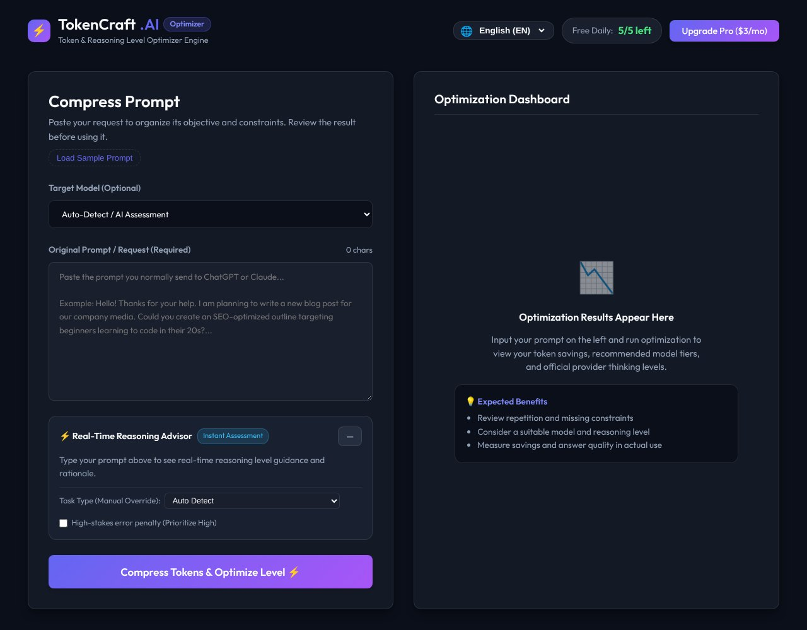

## どんなサービス？

「TokenCraft.AI」は、ChatGPTやClaudeなどに送るプロンプトを、短く整理してくれるWebツールです。日本語の指示は、英語より多くのトークンを使いがちで、冗長な挨拶や曖昧な修飾語が、使える文脈を圧迫します。さらに推論モデルでは、見えない「思考トークン」で料金が増えます。そんな悩みから作られました。

登録は不要で、無料で使えます（1日あたりの無料枠あり、Proプランも用意されています。確認日：2026年10月8日）。

*画像：TokenCraft.AI公式サイト（2026年10月8日に取得）*

## できること

開発記によると、主な機能は2つです。

- **プロンプトの圧縮・構造化：** 長い依頼文を、「目的・条件・出力形式・完了条件」の4つの要素に整理し、重複した表現や不要な装飾を削る
- **推論レベルの推奨：** タスクの複雑さや、間違いのリスクに応じて、低・中・高のどのレベルで実行すべきかの目安を示す。定型作業に、過剰な推論コストをかけるのを防ぐ

対象のモデルを選ぶこともできます。画面は、日本語と英語をはじめ、7つの言語に対応しています。

## ここがポイント

- **Before／Afterがわかりやすい。** 開発記には、長い報告メールの依頼文を、4つの要素に整理した例が載っています。
- **初期表示が速い構成。** SPAと静的プリレンダリングを組み合わせ、表示の速さと、検索エンジンからの見つけやすさの両方を考えています。
- **結果は確認してから使う。** 画面にも、結果を確認してから使うよう案内があります。

## リンク

- サービス: [TokenCraft.AI](https://puronnpt.vercel.app/)
- 開発記（Zenn）: [【個人開発】ChatGPTの無駄なトークン消費とAPI従量課金を削る最適化ツール「TokenCraft.AI」を作った](https://zenn.dev/kuroakastudio/articles/f7054ca9ba061a)
