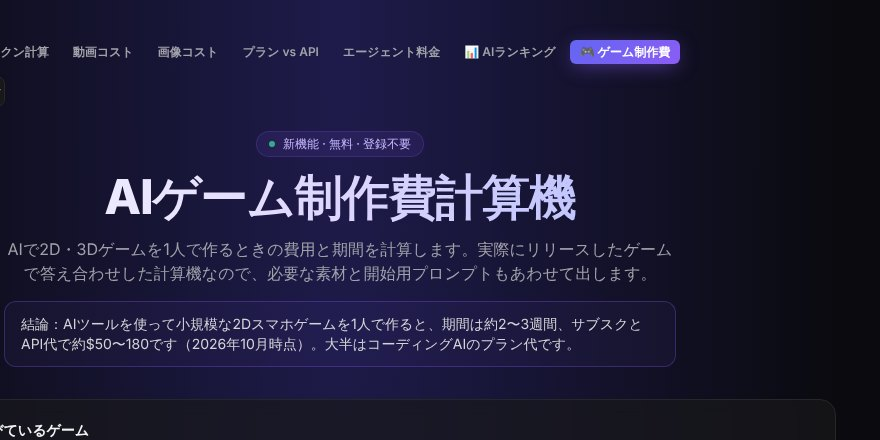

## どんなサービス？

「AIゲーム制作費計算機」は、AIを使って2D・3Dのゲームを1人で作るときの、費用と期間を計算してくれる無料のツールです。「TokenSave」というサイトのひとつで、新機能として公開されています。登録は不要です。

公式ページには、「実際にリリースしたゲームで答え合わせした計算機なので、必要な素材と開始用プロンプトもあわせて出します」と書かれています。結論として、小規模な2Dスマホゲームを1人で作る場合、期間は約2〜3週間、サブスクとAPI代で約50〜180ドルと示されています（2026年10月時点の表示、確認日：2026年10月8日）。

*画像：TokenSave公式サイト（2026年10月8日に取得）*

## 使い方

入力は、基本的にボタンを押していくだけです。文字を打つのは、ゲーム名くらいです。

- ジャンルや規模、絵柄、2Dか3Dか
- キャラクターの数、BGMの数、対応言語の数
- 広告、アプリ内課金、セーブ、対象のOS
- 使うツール（コーディングAI、画像のAI、BGMなど）

結果として、費用と期間の目安、必要な素材、AIに最初に渡すプロンプトが出ます。サイトは、日本語を含む多くの言語に対応しています。

## ここがポイント

- **自分のゲームで答え合わせ。** 開発記によると、開発者のリリース済みのゲームの条件を計算機に入れたところ、予測が47〜102ドルに対して、実際は45ドルでした。期間は、予測の19〜31日に対して、実際は約17日です。
- **画像のコストは、予測より低かった。** 予測では画像に10ドルを見込んでいましたが、実際はキャラクターも背景もAIがコードで描画して0ドルでした。
- **コード経験ゼロから。** 開発者は、コードの経験がなく、AIに言葉で説明してゲームを作っている、韓国の個人開発者です。

計算結果は、あくまで目安です。

## リンク

- サービス: [AIゲーム制作費計算機](https://tokensave.app/ja/ai-game-cost-calculator.html)
- 開発記（Qiita）: [自作のAIゲーム費用計算機に、リリース済みの自分のゲームを入れてみた：予測 vs 実際](https://qiita.com/yunany90/items/6db61536f0627c2402a1)
