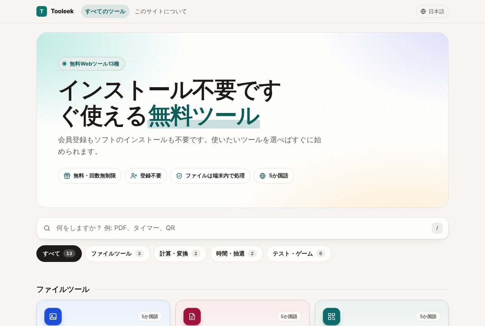
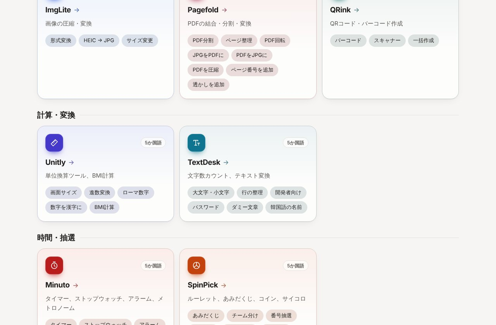

## どんなサービス？

「Tooleek」は、ブラウザですぐ使える無料のWebツールを集めたサイトです。画像の圧縮、PDFの結合・分割、QRコードの作成、単位換算、文字数カウントなど、ちょっとした作業に使うツールが、13種そろっています。

公式ページによると、会員登録もソフトのインストールも不要で、無料で回数の制限もありません。運営費は、広告でまかなうと書かれています。

*画像：Tooleek公式サイト（2026年10月8日に取得）*

## どんなツールがある？

- **ファイルツール:** ImgLite（画像の圧縮・変換）、Pagefold（PDFの結合・分割・変換）、QRink（QRコード・バーコードの作成）
- **計算・変換:** Unitly（単位換算、BMI計算）、TextDesk（文字数カウント、テキスト変換）
- **時間・抽選:** Minuto（タイマー、ストップウォッチ）、SpinPick（ルーレット、あみだくじ、コイン、サイコロ）
- **テスト・ゲーム:** KeyRace（タイピングテスト）、Reflexa（反応速度・記憶力のテスト）、ByEye（円描き・色感・音感のテスト）、Checkbay（キーボード・マウス・カメラ・マイクのテスト）、Comma Puzzles（ナンプレ、ソリティアなど）、TripType（旅行タイプ診断）

*画像：Tooleek公式サイトのツール一覧（2026年10月8日に取得）*

## ここがポイント

- **ファイルは端末の中で処理される。** 画像、PDF、QRなどのファイルは、ブラウザ内で処理され、サーバーにはアップロードされないと、公式ページに書かれています。
- **5か国語に対応。** 韓国語、英語、日本語、中国語（簡体字）、スペイン語で使えます。
- **スマホでも使える。** ほとんどのツールは、スマートフォンやタブレットでも動くとのことです。
- **サーバーを持たない作り。** 開発者の開発記によると、ツールはすべて静的なページで、サーバーのコードもデータベースも持たない構成です。

## リンク

- サービス: [tooleek.com](https://tooleek.com/ja/)
- 開発記（Qiita）: [サーバーなしで無料ツールサイトを14個、ほぼ全部5言語対応で作った構成メモ](https://qiita.com/tooleek/items/e479d500af294adda25f)
