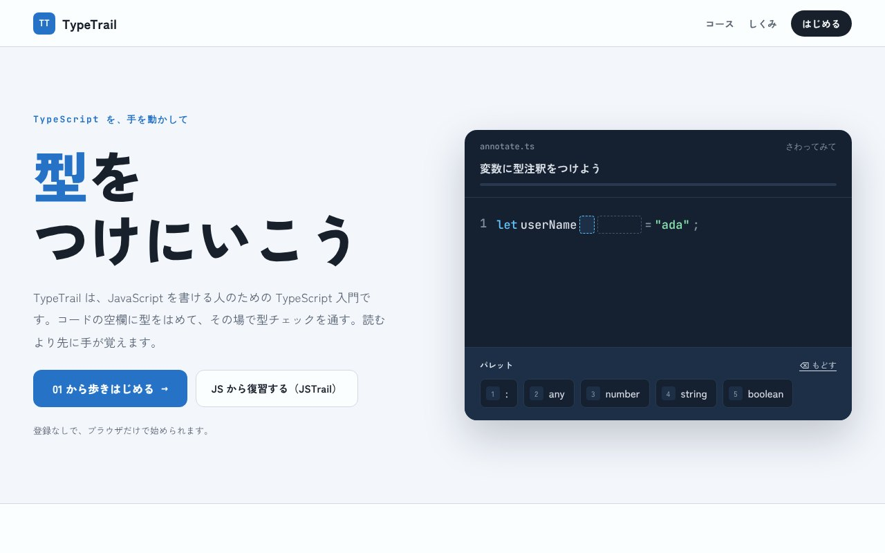

## どんなサービス？

「TypeTrail」は、JavaScriptが書ける人のための、TypeScript入門サービスです。公式ページには、「コードの空欄に型をはめて、その場で型チェックを通す。読むより先に手が覚えます」とあります。登録なしで、ブラウザだけで始められます。

コードを一文字ずつ入力する代わりに、画面に並んだ選択肢をタップして完成させます。環境構築やタイピングに気を取られず、型や文法の並び方に集中できます。

*画像：TypeTrail公式サイト（2026年10月8日に取得）*

## 学び方

公式ページによると、1ステップは「読む・はめる・通す」の3つです。

1. **読む：** 数行の短い説明を読む
2. **はめる：** パレットから型を選んで、空欄を埋める（数字キーでも選べる）
3. **通す：** 埋めた瞬間に型チェックの結果がわかる。まちがえたら、戻してやり直す

15のチャプターで、型注釈と型推論から、ジェネリクス、ユーティリティ型、JSからTSへの書きかえまでを歩きます。

## ここがポイント

- **トップページで体験できる。** 説明を読むより先に触ってもらうため、その場で型をはめて「型チェックを通過しました」まで体験できるデモがあります。
- **JavaScriptの復習もできる。** mapやfilter、async/awaitなどを練習できる「JSTrail」も用意されています。
- **デザインは何案も比べて決めた。** 開発記によると、Claude Designで複数のデザイン案を作り、見比べて選ぶことを繰り返したそうです。

## リンク

- サービス: [TypeTrail](https://type-trail-chi.vercel.app/)
- 開発記（Zenn）: [TypeScriptでTypeScriptを学ぶサービスを作った](https://zenn.dev/dkdk443/articles/typescript-de-learning-typetrail)
