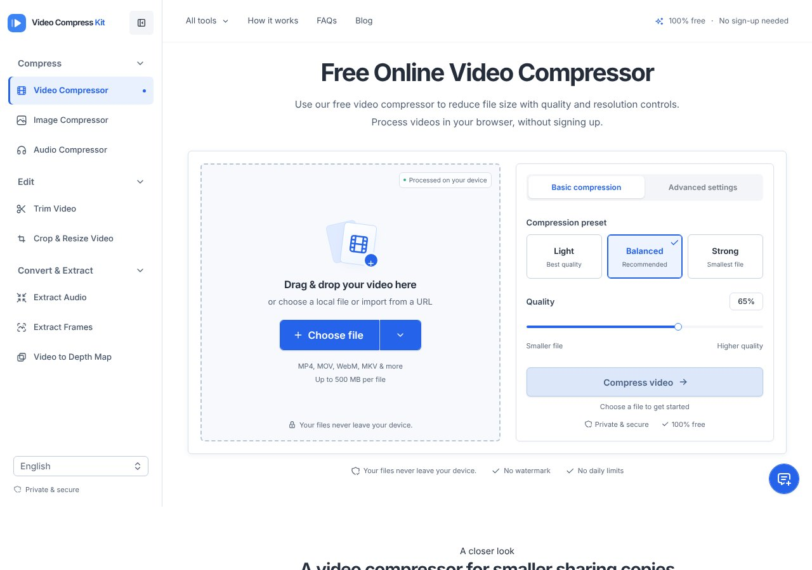
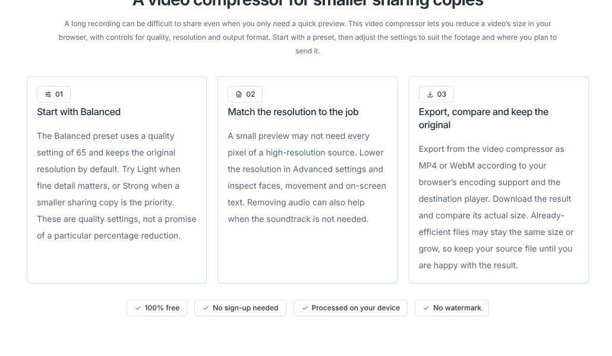

## どんなサービス？

「Video Compress Kit」は、動画や音声の圧縮・変換を、ブラウザの中で行うWebツールです。公式ページには「100% free」「No sign-up needed」「Processed on your device」と書かれています。

ファイルをドラッグして、画質のプリセットを選び、圧縮するだけ。画面は英語が中心ですが、言語を切り替える欄があります。

*画像：Video Compress Kit公式サイト（2026年10月8日に取得）*

## できること

公式ページの左側のメニューには、次の機能が並んでいます。

- 圧縮：動画、画像、音声
- 編集：動画のトリミング、クロップとリサイズ
- 変換と抽出：音声の取り出し、フレームの取り出し、動画の深度マップ

圧縮は「Light」「Balanced（おすすめ）」「Strong」の3つのプリセットから選べ、画質や解像度も細かく調整できます。公式ページによると、1ファイルあたり500MBまでです。

*画像：Video Compress Kit公式サイト（2026年10月8日に取得）*

## ここがポイント

- **アップロードしない仕組み。** 開発記によると、サーバーはWebアプリのコードを配るだけで、メディアの解析・変換・書き出しはブラウザの中で行います。「プライバシーを説明文だけにせず、アーキテクチャとして成立させる」ことを重視したそうです。
- **メディア処理はMediabunny。** ブラウザのメディアAPIを扱うJavaScriptライブラリを使い、MP3やFLACのエンコーダーは必要になったときに読み込みます。
- **透かしなし。** 公式ページに「No watermark」「No daily limits」と書かれています。

## リンク

- サービス: [Video Compress Kit](https://videocompresskit.com/)
- 開発記（Qiita）: [Mediabunnyで動画・音声をブラウザ内処理する「Video Compress Kit」を作った](https://qiita.com/xdy18875854140/items/391599b474bbb82a8020)
