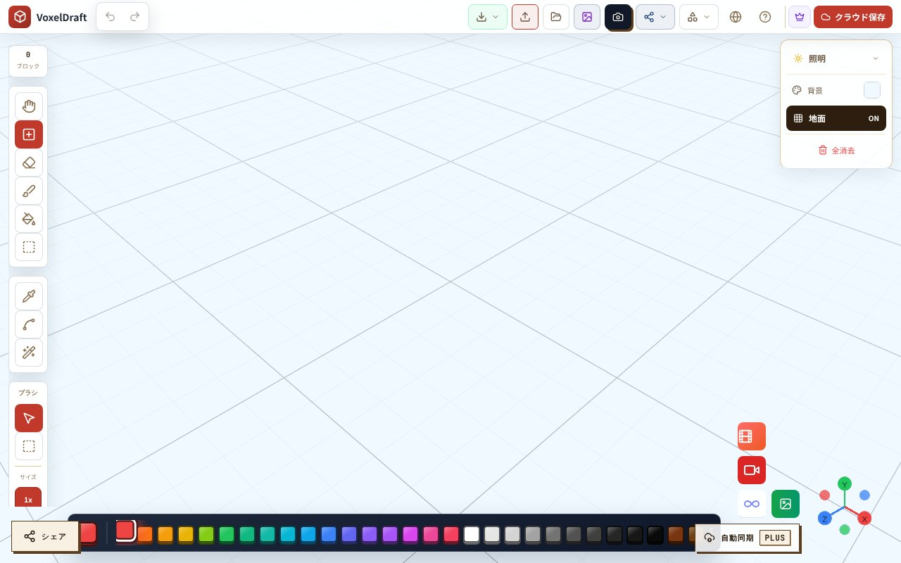

## どんなサービス？

「VoxelDraft」は、小さな立方体（ボクセル）を積み上げて、立体のドット絵を作るブラウザ上のエディタです。インストールや登録なしで、開くとすぐに編集画面が表示されます。

画面の左にツール、下に色のパレットが並び、床のグリッドの上にブロックを置いていく作りです。

*画像：VoxelDraft公式サイト（2026年10月8日に取得）*

## 開発記から分かること

開発者の開発記によると、次のような作りになっています。

- **データを正にする。** 編集中の状態は、位置と色を持つ、シリアライズできるデータとして保持しています。Three.jsのオブジェクトをそのまま保存しない設計で、JSON保存やundo/redo、別形式への書き出しが楽になったそうです。
- **書き出しの形式。** VOX、Minecraft Schematic、Roblox RBXL、GLBなどに対応しています。
- **GIFの生成。** 制作過程やアニメーションのGIF化は、編集画面が止まらないよう、専用のWorkerで処理しています。

## ここがポイント

- **ブラウザだけで完結する。** 開発記のタイトルにも「ブラウザ完結のボクセルエディタ」とあります。
- **書き出し処理を分けている。** ボクセルの配列を受け取り、ファイルを返す関数として切り出し、画面の操作と分けています。
- **日本語の画面がある。** 編集画面のURLに /ja/ が付いており、日本語で使えます。

## リンク

- サービス: [VoxelDraft](https://voxeldraft.com/ja/edit/)
- 開発記（Qiita）: [React Three Fiberでブラウザ完結のボクセルエディタを作った](https://qiita.com/Renburu/items/430328e9993f8499c07f)
