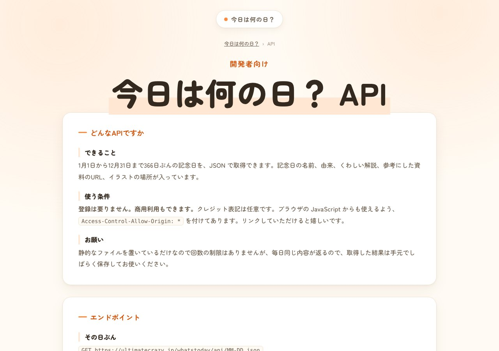
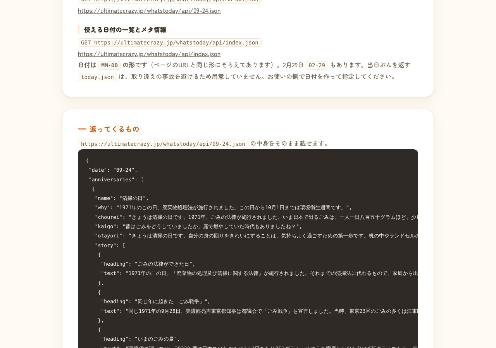

## どんなサービス？

「今日は何の日？API」は、366日分の記念日の情報を、JSON形式で返す無料のAPIです。公式ページによると、登録もAPIキーも不要で、商用利用もできます。クレジットの表記は任意です。

「今日は何の日」を、アプリやボットに表示したいときに、すぐ使えるようにと作られました。



*画像：今日は何の日？API公式サイト（2026年10月8日に取得）*

## 使い方

日付を「MM-DD」の形で指定して、JSONのファイルを取得します。2月29日にも対応しています。

```
https://ultimatecrazy.jp/whatstoday/api/12-24.json
```

ブラウザのJavaScriptからも、そのまま呼び出せます（CORS対応）。公式ページには、curlとfetchの例が載っています。

## 返ってくるもの

記念日の名前、由来の短い説明、くわしい解説、参考にした資料のリンク、その日のイラスト（オリジナル）などです。ほかのAPIと違うのは、**そのまま使える文章**が、3種類入っていることです。

- **朝礼用:** 朝礼でそのまま読み上げられる文（80〜100字前後）
- **介護レク用:** 朝の会などで使う問いかけ（40字前後）
- **おたより用:** 学級通信などで使うひとこと



*画像：今日は何の日？API公式サイト（2026年10月8日に取得）*

## ここがポイント

- **止まりにくい作り。** 静的なファイルを置いているだけなので、リクエストの上限はなく、サーバーの都合で止まる理由が少ないと、公式ページに書かれています。
- **「今日のぶん」のファイルはない。** 差し替えの遅れで、全員に前日の内容が返る事故を避けるため、日付は使う側で作って指定する形です。
- **キーの追加・削除のルールが明確。** キーを削除・改名するときは、ページで告知し、バージョンを上げます。追加は告知なしで行われ、既存のコードには影響しないとのことです。

## リンク

- サービス: [ultimatecrazy.jp/whatstoday/api/](https://ultimatecrazy.jp/whatstoday/api/)
- 開発記（Qiita）: [登録不要・CORS対応の「今日は何の日」API を作りました（366日・商用可）](https://qiita.com/nakanaka-uc/items/01b886f8976afdca42ca)
