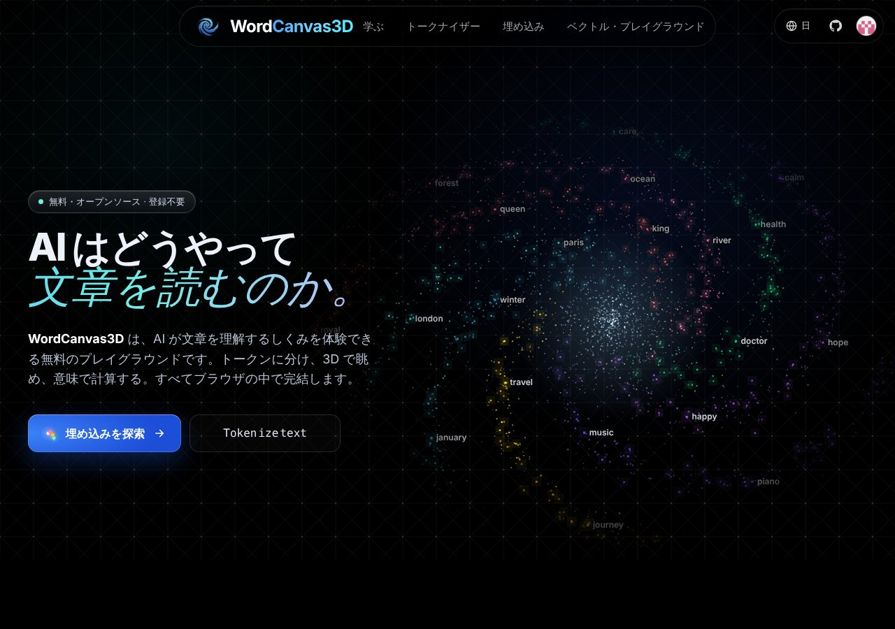

## どんなサービス？

「WordCanvas3D」は、AIが文章を理解するしくみを、体験しながら学べる無料のプレイグラウンドです。公式ページの言葉は、「トークンに分け、3Dで眺め、意味で計算する。すべてブラウザの中で完結します」。無料、広告なし、登録不要で、コードはGitHubで公開されています。

*画像：WordCanvas3D公式サイト（2026年10月8日に取得）*

## 3つのツール

- **トークナイザー：** 文章をどう区切るかを比べ、絵文字や珍しい単語が多くのトークンを使う理由を確かめる
- **埋め込み：** 最大1万語の単語を3Dの空間で眺める。数字、場所、感情などのかたまりが自然にできる
- **ベクトル・プレイグラウンド：** 単語を矢印として描き、king − man + woman が queen の近くに着く、といった類推を試せる

初心者向けの解説記事（トークン、埋め込み、Transformerなど）も用意されています。画面は日本語に対応しています。

## ここがポイント

- **きっかけは動画。** 開発記によると、3Blue1Brownの動画で「queen − king ≈ woman − man」を知り、ほかの単語ではどうなっているか見たくて作り始めたそうです。
- **作りながら機能が増えた。** 「文章はどう区切られているのか」「似た単語は近くにあるのか」と疑問が出るたびに、機能を足していった、と書かれています。
- **オープンソース。** フォークや翻訳の追加も歓迎、とあります。

## リンク

- サービス: [WordCanvas3D](https://wordcanvas3d.vercel.app/ja/)
- ソースコード: [Akage1234/WordCanvas3D](https://github.com/Akage1234/WordCanvas3D)
- 開発記（Zenn）: [単語ベクトルの世界を3Dで探索できるツールを作った](https://zenn.dev/akage/articles/dfaba4e5c8bd26)
