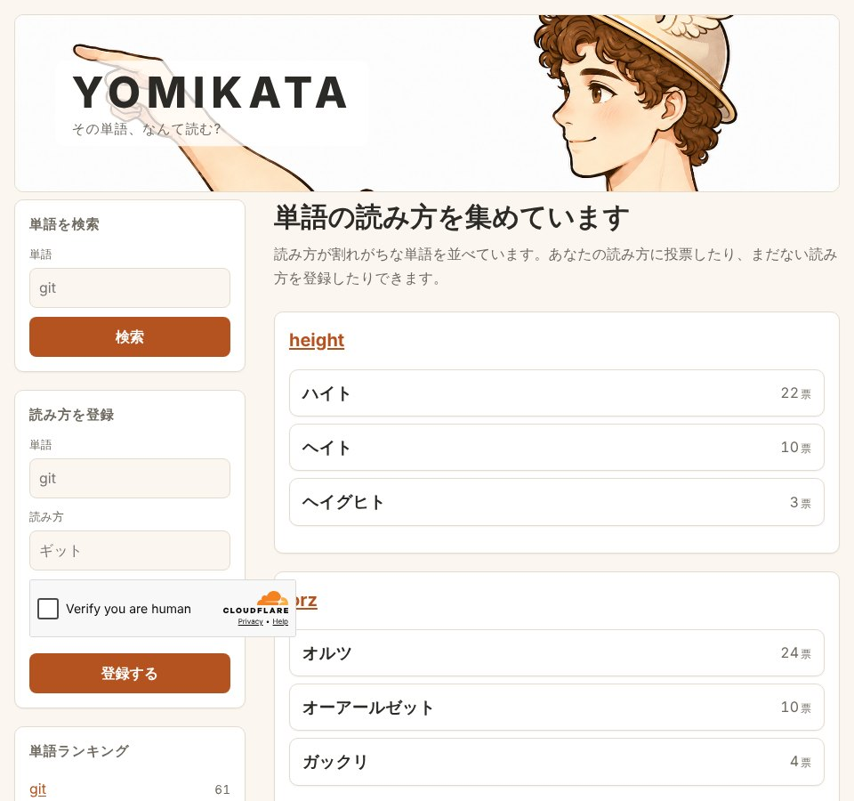

## どんなサービス？

「YOMIKATA」は、読み方が割れがちな単語に、みんなで投票するWebサービスです。サブタイトルは「その単語、なんて読む？」。公式ページには「読み方が割れがちな単語を並べています。あなたの読み方に投票したり、まだない読み方を登録したりできます」とあります。

たとえば「height」は「ハイト」と「ヘイト」、「git」は「ギット」と「ジット」のように、票の多い順に読み方が並びます。

*画像：YOMIKATA公式サイト（2026年10月8日に取得）*

## できること

- 単語を検索して、読み方を見る
- 自分の読み方に投票する
- まだない読み方を登録する
- 単語ランキングと、新しく登録された読み方を見る

## ここがポイント

- **表記ゆれで票を分散させない。** 開発記によると、「Git / git / ＧＩＴ」や「やま / ヤマ / ﾔﾏ」が別のデータにならないよう、保存の前に正規化しています。読み方はひらがなをカタカナにそろえます。
- **Cloudflareにまとめた構成。** Workers、Hono、D1で作り、ボット対策にTurnstileを使っています。小規模な個人開発なので、サーバーを別に管理しない作りにしたそうです。
- **単語ごとのページ。** 単語ごとにHTMLを返すので、検索エンジンにも認識されやすく、ブラウザでの画面遷移は軽くしています。

## リンク

- サービス: [YOMIKATA](https://yomikata.ix.workers.dev/)
- 開発記（Qiita）: [「git」は「ギット」？「ジット」？みんなの読み方を投票できる「YOMIKATA」を作った](https://qiita.com/xeje/items/7c76983f2b93ef572ac3)
