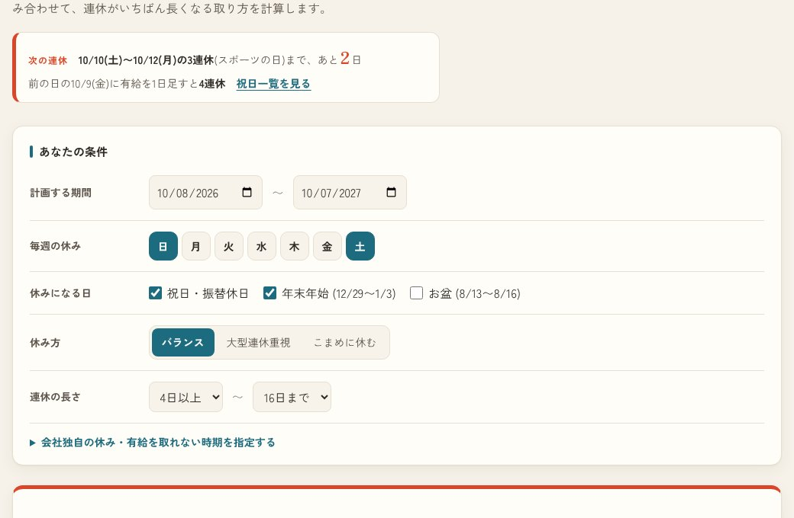

## どんなサービス？

「有給パズル」は、有給の日数と計画する期間を入れると、どの日に取ればいちばん長く休めるかを、計算して教えてくれるWebツールです。トップには「有給10日で、いちばん長く休む。」と書かれています。

*画像：有給パズル公式サイト（2026年10月8日に取得）*

## できること

- 計画する期間、毎週の休み、祝日・年末年始・お盆を休みにするかを選ぶ
- 「バランス」「大型連休重視」「こまめに休む」から休み方を選ぶ
- 連休の長さの下限や上限を指定する
- 会社独自の休みや、有給を取れない時期を指定する
- 結果の共有（X・LINE・画像保存・リンクのコピー）と、カレンダーへの一括登録（.ics）

結果の画面には、「有給10日で、合計50日休める」「いちばん長い連休 9連休」「有給1日あたり4.5日休める」といった数字が並び、取る日の候補が一覧で出ます。数字は、入力した条件によって変わります。

*画像：有給パズル公式サイト（2026年10月8日に取得）*

## ここがポイント

- **動的計画法で解いている。** 開発記によると、日を先頭から見ていく動的計画法で、最適な取り方を求めています。
- **連休の数え方をそろえている。** 「土曜から数えた5連休」と「日曜から数えた4連休」のような数え違いが混ざらないよう、連休を「極大な区間」に限っています。
- **祝日は自前で計算。** 春分・秋分の近似式や、振替休日、国民の休日の処理を実装し、内閣府が公表している2026年の祝日と一致することを確認したそうです。

## リンク

- サービス: [有給パズル](https://yukyu-puzzle.pages.dev/)
- 開発記（Qiita）: [「有給は何日に取るのが最強か」を動的計画法で解くWebツールを作った](https://qiita.com/hasida3214/items/1e10a10333cc8c17c828)
